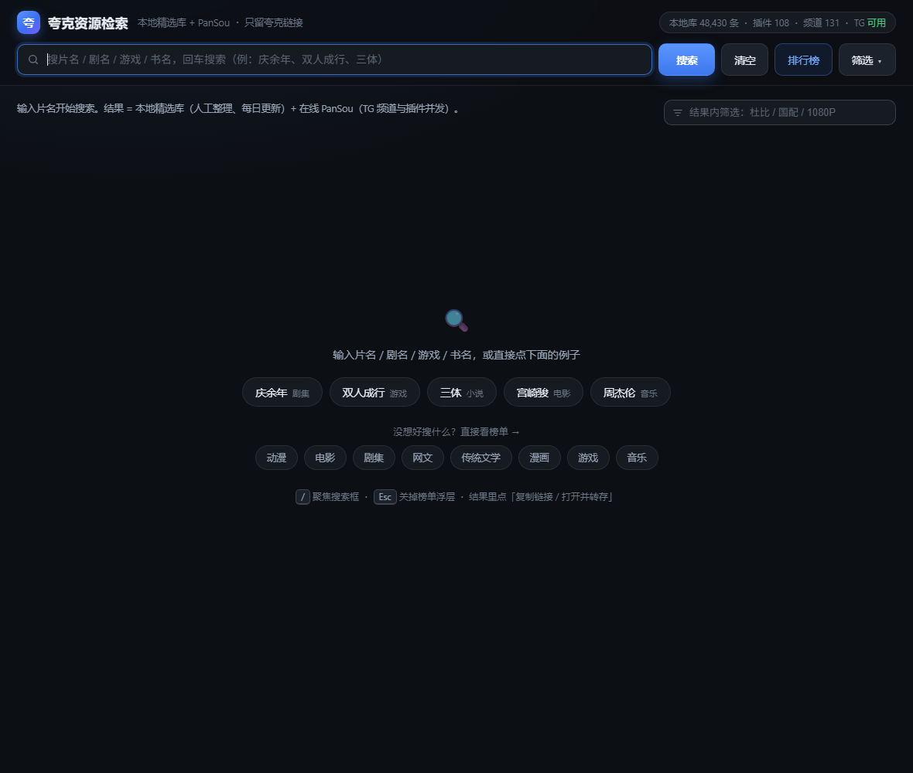
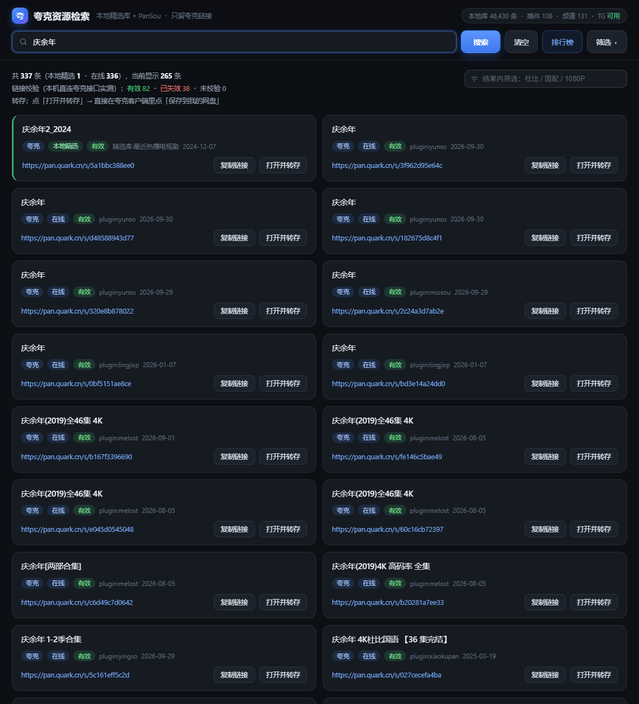
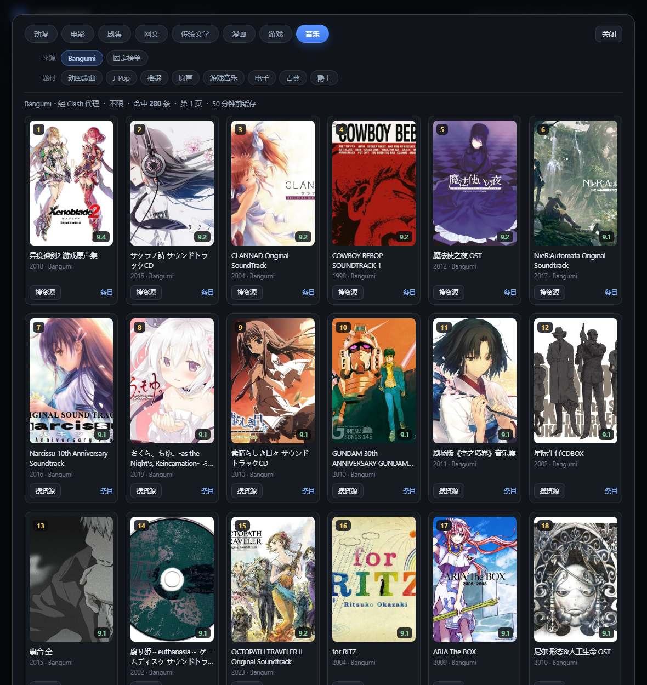

# 夸克资源检索 · Quark Netdisk Search

> 只跑在自己电脑上的**夸克网盘资源检索台**：把 Telegram 网盘分享频道 + 几十个影视站插件的结果聚合到一起，
> **只保留夸克链接**，再配上本地精选库、链接判活和影视榜单。

**纯本地运行** · 只监听 `127.0.0.1` · 不接触你的网盘账号密码 · 不装服务、不写注册表



## 目录

- [它长什么样](#它长什么样)
- [下载即用](#下载即用windows)
- [界面说明](#界面说明)
- [功能详解](#功能详解)
- [配置](#配置)
- [从源码运行 / 自己打包](#从源码运行--自己打包)
- [常见问题](#常见问题)
- [数据源](#数据源)
- [免责声明](#免责声明)

## 它长什么样

| 搜索结果（只留夸克链接） | 音乐榜浮层（Bangumi） |
| --- | --- |
|  |  |

## 下载即用（Windows）

1. 到 [Releases](../../releases) 下载 `quark-netdisk-search-1.1.4-win64.zip`（约 55 MB）
2. 解压到任意目录（建议放纯英文路径，少踩玄学坑）
3. 双击 **`夸克资源检索.cmd`** → 浏览器自动打开 <http://127.0.0.1:8899>

- **不需要装 Node.js**（运行时已内置在 `runtime/node.exe`）
- **不需要管理员权限**，不写注册表
- 关闭后台服务：双击 `停止服务.cmd`

> 如果 [Releases](../../releases) 还是空的，直接看下面的[从源码运行 / 自己打包](#从源码运行--自己打包)。

## 运行环境

| 项目 | 要求 |
| --- | --- |
| 系统 | Windows 10 / 11 x64 |
| 运行时 | 便携包已内置 Node，无需安装 |
| 代理 | **自动探测**：有代理就用，没有就直连（Clash Verge / v2ray 等） |
| 夸克账号 | 自己登录夸克客户端，本工具不接触账号密码 |

### 没有代理能不能用？能。

启动时会自动探测本机代理，按顺序试 `7897` / `7890` / `7891` / `7892` / `1080` / `10808` / `10809` / `2080`：
探到就挂上，探不到就走直连。想固定端口，在 `config.cmd` 同目录放一个 `proxy-port.txt`，里面只写端口号。

同一关键词「庆余年」的夸克结果条数实测（不含本地精选库）：

| 场景 | 夸克结果 | 说明 |
| --- | --- | --- |
| 有代理 | **372 条** | Telegram 频道 + 插件全开 |
| 没代理（自动直连） | **217 条** | 108 个插件里 79 个是国内直连站，照常出结果 |
| 没代理、却写死了代理端口 | 48 条 | 请求全打到不存在的 SOCKS5，源几乎全废 |

也就是说：**决定结果多少的不是「有没有代理」，而是「代理配置对不对」**。
没代理时只有 Telegram 频道（131 个）和 Bangumi 榜单用不了，
插件源和本地精选库（约 3.5 万条离线索引）都照常工作。

实测能国内直连的插件站（108 个里 79 个，节选）：

| 插件 | 站点 | 插件 | 站点 |
| --- | --- | --- | --- |
| `hunhepan` | hunhepan.com | `haitunsou` | haitunsou.com |
| `pansearch` | pansearch.me | `hdmoli` | hdmoli.com |
| `xiaokupan` | xiaokupan.com | `dygang` | dygang.tv |
| `quark4k` | quark4k.com | `xb6v` | xb6v.com |
| `sousou` | sousou.pro | `5266ys` | 5266ys.net |
| `panlian` | pinglian.lol | `rrbt` | rrbts.org |
| `libvio` | libvio.host | `yulinshufa` | yulinshufa.cn |
| `lingjisp` | web5.mukaku.com | `dy4k` | 4kdy.vip |

确实需要代理的插件只有 7 个：`cyg` `duoduo` `qqpd` `weibo` `duanjuw` `miosou` `zhizhen`。

> 便携包里的 `app/pansou.exe` 是在上游 PanSou 基础上**额外接线 34 个插件**后自编译的
> （上游 `main.go` 只 import 了 77 个插件包，仓库里另有 34 个写好了却没接上），
> 可用插件因此从 74 个增加到 108 个。改动只有 import 列表这一处，详见 `THIRD-PARTY.md`。

## 界面说明

### 顶部状态栏

```
本地库 48,430 条 · 插件 108 · 频道 131 · TG 可用
```

- **本地库**：离线条数 = 精选索引（人工整理，含链接）+ **本地游戏库**（方舟游戏整站种子表，自带夸克链接）
- **插件 / 频道**：本次实际启用的搜索源数量，可在 `config.cmd` 里增删
- **TG 可用 / 不可用**：Telegram 频道是否连通（走代理）。不可用时只剩插件源 + 本地精选库

### 首屏（还没搜的时候）

空着一大片黑不叫设计，所以首屏直接放两排捷径：

- 第一排**例子**：庆余年 / 双人成行 / 三体 / 宫崎骏 / 周杰伦 —— 点一下等于在输入框里打完再回车
- 第二排**直达榜单**：动漫 / 电影 / 剧集 / 网文 / 传统文学 / 漫画 / 游戏 / 音乐 —— 点了直接打开对应分类的榜单浮层

### 搜索行与快捷键

搜索框 + `搜索` / `清空` / `排行榜` / `筛选` 四个按钮，回车即搜。

| 按键 | 作用 |
| --- | --- |
| `Enter` | 在搜索框里回车 = 搜索 |
| `/` | 任意位置聚焦搜索框 |
| `Esc` | 关掉榜单浮层 |

### 筛选面板（默认收起）

搜索时不该先看一堆勾选框，所以它们收在 `筛选 ▾` 按钮里。**只要你改动过任何一项，面板会自己摊开**，不会出现「改了却不生效、还以为坏了」。

| 分组 | 勾选项 | 默认 | 作用 |
| --- | --- | --- | --- |
| 范围 | 只看本地精选 | 关 | 只显示离线精选库，完全不联网 |
| 范围 | 只看合集/全集 | 关 | 只留标题含 合集/全集/全季/合辑/系列 的条目 |
| 范围 | 去掉小说/漫画/软件/预告 | **开** | 按关键词剔除 txt/epub/pdf/小说/漫画/apk/预告/花絮/解说/原声 等 |
| 范围 | 只要 4K | 关 | 只留标题含 4K 的条目 |
| 入库 | 含短剧 | 关 | 放开对短剧的排除 |
| 入库 | 含历史归档 | **开** | 是否包含历史归档分享 |
| 入库 | 含阿里/百度 | 关 | 除夸克外额外显示阿里/百度等网盘（默认只看夸克） |
| 链接 | 用夸克客户端打开 | **开** | 点「打开并转存」时直接调起夸克客户端；关掉则用浏览器打开 |
| 链接 | 自动校验链接 | **开** | 出结果后自动逐个判活 |
| 链接 | 仅显示有效 | 关 | 隐藏「已失效 / 未校验」的条目 |

### 结果区

- 卡片网格：宽屏两列、窄屏一列，长链接自动省略，右上角是操作按钮
- 每张卡片：来源标签（**本地精选** / **在线**）、判活徽标、**复制链接**、**打开并转存**
- 右上「结果内筛选」在当前结果里二次过滤，如 `杜比`、`国配`、`1080`、`第二季`
- 上方信息行汇总：共多少条（本地 / 在线各多少）、有效 / 已失效 / 未校验统计、以及转存提示

### 榜单浮层

点 `排行榜` 或首屏的直达按钮 → 盖一层全屏浮层（不挤压搜索结果，关掉就回到原来的列表）：

- 八个分类 tab：**动漫 / 电影 / 剧集 / 网文 / 传统文学 / 漫画 / 游戏 / 音乐**
- 每个分类可切**来源**，来源下面才是**产地**和**题材**（多选，选多项表示「同时满足」）
- 「清空筛选」一键回到不限
- 点卡片上的**封面**或用「搜资源」按钮 → 直接拿片名去搜网盘资源
- 「加载更多」翻页，卡片角标是名次和评分
- **游戏** tab 的「方舟游戏」源自带夸克链接，卡片右侧按钮直接显示 **夸克**，点一下就能转存；其他来源显示的是豆瓣 / Bangumi 条目页

### 地址栏会记住你的状态

- `?q=庆余年` 打开就直接搜（可以当快捷方式收藏 / 固定）
- `#rank=music` 打开就弹音乐榜浮层，`#rank=movie:top250` 连来源一起指定
- 切分类 / 切来源 / 关浮层时地址栏同步更新，刷新页面回到原状态

## 功能详解

### 1. 搜索

结果 = **本地精选库**（离线秒出）+ **在线 PanSou**（TG 频道 + 插件并发抓取），两路合并去重后统一排序。
切换勾选项会即时重排，不用重新联网。

### 2. 链接判活

对每条夸克分享链接做**本机两步校验**：先取分享令牌（`sharepage/token`），再用令牌拉文件列表（`sharepage/detail`），
拿到真实状态后才打标。界面上只有三种结果：

| 显示 | 含义 |
| --- | --- |
| 有效 | 令牌和文件列表都正常，点开就能存 |
| 已失效 | 分享不存在 / 已过期 / 违规 / 封禁 / 已取消（夸克返回 41006、41009、41010、41011、41012、41031 统一归为失效）|
| 需提取码 / 未校验 | 需要提取码、提取码不对、网络异常，或还没轮到校验 |

校验结果会缓存（有效 12 小时、失效 3 小时），所以同样的词第二次搜几乎是秒出。

### 3. 转存到夸克（3 步）

1. 点结果卡片上的 **「打开并转存」**
2. 夸克客户端会自动弹出并定位到那个分享
3. 点 **「保存到我的网盘」**，完成

> 默认就是「用夸克客户端打开」；如果你更喜欢网页版，把那个勾去掉即可。

### 4. 影视 / 图书 / 游戏 / 音乐榜单

| 分类 | 可用来源 | 可筛维度 |
| --- | --- | --- |
| 动漫 | Bangumi / 豆瓣 | 产地（国漫·日漫·欧美）、题材（热血·机战·奇幻…）|
| 电影 | 豆瓣 / Bangumi / 固定榜单 | 产地 13 项（中国大陆·美国·日本…）、题材 25 项 |
| 剧集 | 豆瓣 / Bangumi / 固定榜单 | 产地 8 项（国产剧·美剧·英剧·日剧·韩剧·港剧·台剧·泰剧）、题材 23 项 |
| 网文 | 豆瓣图书 / Bangumi / 固定榜单 | 题材 9 项（网络小说·玄幻·仙侠·言情·都市·武侠·轻小说·奇幻·科幻）|
| 传统文学 | 豆瓣图书 / Bangumi / 固定榜单 | 产地 8 项（中国文学·日本文学·欧美文学…）、题材 16 项（小说·经典·散文·诗歌·传记·推理·社会·哲学…）|
| 漫画 | 豆瓣图书 / Bangumi / 固定榜单 | 产地 2 项（日本漫画·欧美漫画）、题材 4 项（漫画·绘本·画集·日本漫画）|
| 游戏 | **方舟游戏（本地离线库）** / Bangumi | 题材由本地库实时统计（冒险·动作·独立·模拟·角色扮演·像素图形…）；Bangumi 侧按平台/类型（PC·Switch·PS4·Galgame…）|
| 音乐 | Bangumi / 固定榜单 | 题材 8 项（动画歌曲·J-Pop·摇滚·原声·游戏音乐·电子·古典·爵士）；「固定榜单」是豆瓣热门音乐 |

「固定榜单」是成榜：电影有 Top250 / 一周口碑榜 / 正在热映 / 即将上映，剧集有全球口碑 / 华语口碑 / 分类榜，
网文 / 传统文学 / 漫画共用图书 **Top250** / **热门图书**（同一份榜，三个 tab 都能翻），音乐有豆瓣**热门音乐**。

**游戏·方舟游戏**是本地离线库，和其他来源不一样：

- 数据在 `app/lib/games.json`，条目标题自带封面、体积、版本、标签，并且**直接带夸克分享链接**（卡片右侧按钮就是「夸克」）
- 同一份数据也并入了主搜索的「本地精选库」，所以直接在搜索框打游戏名也能秒出本地链接
- 想看更多/更新：在 `app/lib` 下跑 `node harvest-fzgamer.js --limit 300`（去掉 `--limit` 是全量，约 1.4 万款，单发限速所以耗时较长；断点续跑，中断了重跑会接着来）

除动漫 / 电影 / 剧集外，**网文 / 传统文学 / 漫画 / 游戏 / 音乐**栏目的「搜资源」都会自动放开「去掉小说/漫画/软件/预告」这个勾选——否则书名（命中「小说」）和游戏（apk/模拟器）会被整类滤掉。

榜单结果按来源维度分页缓存（Bangumi 池 12 小时、豆瓣池 6–12 小时、固定榜单 3–24 小时、本地游戏库 60 秒），
服务启动时会后台预热，所以第一次打开通常已经是热的。

## 配置

便携包根目录的 **`config.cmd`** 是纯文本配置，改完保存、重开一次即可：

| 变量 | 默认 | 说明 |
| --- | --- | --- |
| `PROXY` | 自动探测 | 不用手填：`config.cmd` 按端口表探测本机代理，探不到就走直连。要强制指定就 `set PROXY=socks5://127.0.0.1:<端口>`，或在同目录放 `proxy-port.txt` 只写端口号 |
| `PORT` | `8888` | PanSou 搜索 API 端口 |
| `UIPORT` | `8899` | 网页端口（建议和 `app/ui/server.js` 里的 `UI_PORT` 一起改）|
| `CHANNELS` | 131 个 | 要抓的 TG 频道，逗号分隔。**只留夸克向的频道能明显提速** |
| `ENABLED_PLUGINS` | 111 个 | 启用的站点插件，逗号分隔（当前内核支持其中 108 个）。响应慢的可以删掉 |
| `CACHE_*` | `CACHE_MAX_SIZE=200` / `CACHE_TTL=120` | 搜索缓存条数与分钟数 |
| `ASYNC_*` | 见文件 | 异步插件的响应超时与后台并发 |

> 排行/榜单的缓存是另一个文件：`app/lib/rank-cache.json`，删掉即强制重建。

## 从源码运行 / 自己打包

只依赖 Node 内置模块，**没有 `npm install` 这一步**：

```bash
node app/ui/server.js        # 起 Web 界面，访问 http://127.0.0.1:8899
```

还需要一个 PanSou 搜索 API 在 `127.0.0.1:8888`（第三方项目，见 [THIRD-PARTY.md](THIRD-PARTY.md)）。

自己组装便携包（把 Node 运行时和 pansou.exe 一起塞进去并打成 zip）：

```bash
node package/build.js --pansou <pansou.exe 路径> --node <node.exe 路径> [--out dist]
```

## 常见问题

**搜不到东西 / 结果特别少**
先看 `logs/pansou.log`，并确认搜索服务在跑：<http://127.0.0.1:8888/api/health>。
没装代理时状态栏显示「TG 不可用」是正常的——插件源和本地精选库不受影响，照样出结果。
反过来，**没代理却把 `PROXY` 写死成某个端口**才是真正的坑：所有插件请求都会打到不存在的代理上，
结果会从 217 条掉到 48 条。删掉 `config.cmd` 里的 `set PROXY=...`，让自动探测生效即可。

**榜单一直转圈或报抓取失败**
Bangumi 源必须走代理（自动探测到才可用）。豆瓣源是直连，一般不受影响。

**点了「打开并转存」没反应**
确认勾了「用夸克客户端打开」，且夸克客户端装在默认位置。
取消勾选就会改用浏览器打开分享页。

**端口被占用**
改 `config.cmd` 里的 `UIPORT`，同时改 `app/ui/server.js` 第 6 行的 `UI_PORT`。

**结果里没有 4K / 全是散集**
用「只要 4K」和「只看合集/全集」两个勾，或者用「结果内筛选」补关键词。

**判活太慢**
取消「自动校验链接」，看完再点「校验全部」；或者干脆关掉，需要时单条点开看。

**榜单数据看起来是旧的**
就是缓存。删 `app/lib/rank-cache.json` 后重启，会重新抓。

**能不能给手机 / 局域网用**
服务只监听 `127.0.0.1`，本就只给本机用；要局域网访问得自行改监听地址，注意别把检索能力暴露到公网。

## 目录结构

```
夸克资源检索.cmd      启动（双击这个）
停止服务.cmd          关掉后台服务
更新精选库.cmd        重建本地精选库索引
config.cmd            代理 / 端口 / 频道 / 插件 / 缓存
proxy-port.txt        可选：只写端口号，强制指定代理端口
app/
  pansou.exe          搜索引擎本体（第三方编译产物）
  ui/server.js        Web 服务：页面 + 搜索代理 + 判活 + 转存 + 榜单路由
  ui/rank.js          榜单数据层：多源抓取 / 组合筛选 / 分级缓存
  ui/index.html       单文件前端
  lib/index.json      本地精选库离线索引
  lib/build-index.js  精选库构建脚本
  lib/games.json      本地游戏库（方舟游戏夸克链接，已并入本地精选库）
  lib/harvest-fzgamer.js  游戏库抓取脚本（断点续跑）
  cache/  logs/       运行时缓存与日志
runtime/node.exe      Node 运行时
```

## 数据源

| 来源 | 用途 | 备注 |
| --- | --- | --- |
| [PanSou](https://github.com/fish2018/pansou) | 网盘搜索 API | TG 频道 + 插件聚合，开源第三方 |
| Bangumi | 动漫 / 电影 / 剧集排名，书籍（type=1）与音乐（type=3）按 tag 拉池 | `api.bgm.tv`，需代理；tag 多选是 AND，单请求上限 20 条 |
| 豆瓣 | 固定榜单 + 组合筛选 | `m.douban.com` 公开接口，直连即可；`/recommend?tags=` 组合筛选单页上限 100 |
| 豆瓣 chart | 动画高分库 | `movie.douban.com/j/chart/top_list` |
| 豆瓣图书 | 图书榜单 + 组合筛选（网文 / 传统文学 / 漫画） | `m.douban.com/rexxar/.../book/recommend`、`subject_collection/book_top250|book_hot` |
| [方舟游戏](https://www.fzgamer.com/) | 游戏条目 + 夸克链接 | WP REST API 列目录，逐篇解析 `pay-download` 的 `down_id=0` 通道（302 → `pan.quark.cn`）；站点有频控，脚本低并发 + 重试 |
| 豆瓣音乐 | 热门音乐榜单 | `subject_collection/music_hot`（豆瓣音乐只有这一个 collection 可用，约 30 条）|

封面图片经本机代理直连原站，不做二次存储。

## 免责声明

本工具只做**检索与聚合**，不存储、不传播任何资源文件；结果全部来自第三方公开分享，网盘链接随时可能失效。
请仅用于个人学习与检索，不要二次传播或用于商业用途，影视资源版权风险请自行把握。
